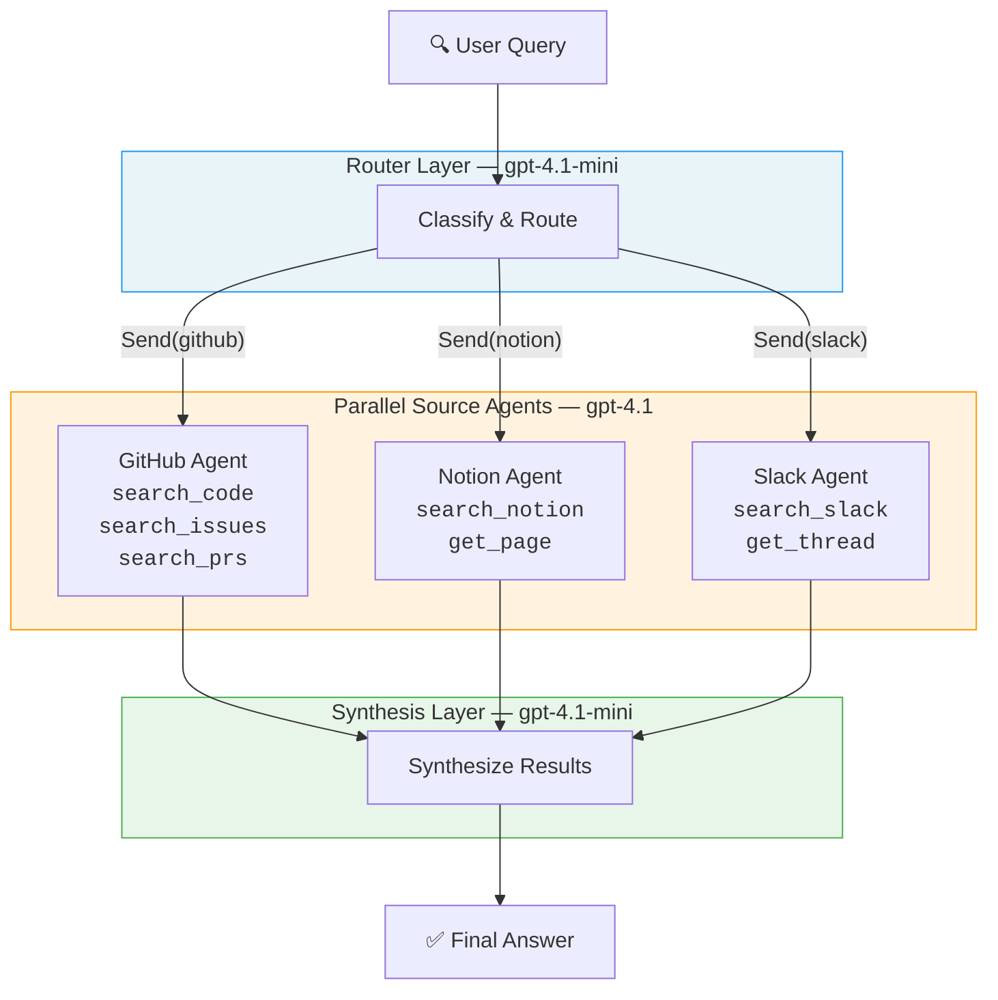
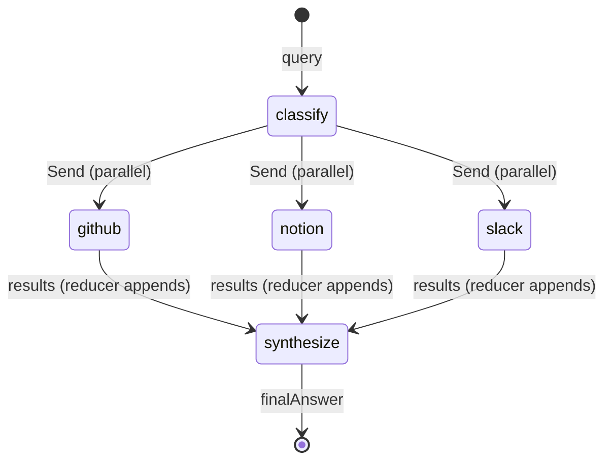

# Multi-Source Knowledge Router

An AI-powered knowledge retrieval system that classifies user queries, routes them in parallel to specialized source agents (GitHub, Notion, Slack), and synthesizes a unified answer. Built with LangGraph for orchestration and LangChain for agent tooling.

## What It Does

When a user asks a question like _"How do I authenticate API requests?"_, the system:

1. **Classifies** the query to determine which knowledge sources are relevant
2. **Routes** targeted sub-questions to specialized agents in parallel
3. **Retrieves** information using source-specific tools (code search, doc lookup, thread search)
4. **Synthesizes** all results into a single, coherent answer

This eliminates the need to manually search across multiple platforms — one question, one answer, all sources.

## Architecture



### LangGraph State Flow



## Project Structure

```
src/
├── index.ts              Entry point — invokes the graph, logs results
├── state.ts              RouterState schema (query, classifications, results, finalAnswer)
├── graph.ts              StateGraph wiring — nodes, edges, conditional fan-out
├── llm.ts                Shared LLM instances (gpt-4.1 + gpt-4.1-mini)
├── logger.ts             Pino logger with pretty-printing and child loggers
├── agents/
│   ├── github.ts         GitHub tools + agent + queryGithub graph node
│   ├── notion.ts         Notion tools + agent + queryNotion graph node
│   └── slack.ts          Slack tools + agent + querySlack graph node
└── nodes/
    ├── classify.ts       Query classification + Send-based fan-out routing
    └── synthesize.ts     Multi-source result synthesis
```

### Key Design Decisions

- **One file per source** — each agent file is self-contained (tools + agent + node). Adding a new source means adding one file and wiring it in `graph.ts`.
- **Parallel fan-out** — LangGraph's `Send` primitive routes to multiple agents concurrently, not sequentially.
- **Two-tier LLMs** — the router and synthesizer use the cheaper `gpt-4.1-mini`; source agents use `gpt-4.1` for deeper reasoning.
- **Structured logging** — every node and tool call is traced with pino, making the full flow visible at runtime.

## Setup

### Prerequisites

- Node.js >= 20
- [pnpm](https://pnpm.io/) >= 9
- An OpenAI API key

### Install

```bash
pnpm install
```

### Configure

```bash
cp .env.example .env
```

Edit `.env` and add your API key:

```
OPENAI_API_KEY=sk-your-actual-key
LOG_LEVEL=info
```

### Run

```bash
# Development (tsx, hot reload)
pnpm dev

# Production (compile + run)
pnpm build && pnpm start
```

### Log Levels

Control verbosity with the `LOG_LEVEL` environment variable:

| Level    | What you see                                                    |
| -------- | --------------------------------------------------------------- |
| `info`   | Workflow lifecycle, classifications, agent durations, synthesis |
| `debug`  | All of the above + individual tool calls and responses          |
| `warn`   | Only warnings (e.g. no results to synthesize)                   |
| `silent` | No logs                                                         |

```bash
# See every tool call and LLM response
LOG_LEVEL=debug pnpm dev
```

## How the Flow Works

1. **`index.ts`** kicks off the graph with a user query.
2. **`classify`** node calls `gpt-4.1-mini` with structured output to decide which sources to query and generates a targeted sub-question for each.
3. **`routeToAgents`** uses LangGraph's `Send` to fan out to the selected agent nodes in parallel.
4. Each **agent node** (`github`, `notion`, `slack`) runs an autonomous ReAct agent that uses its tools to answer its sub-question. Results are appended to state via a reducer.
5. **`synthesize`** node receives all collected results and calls `gpt-4.1-mini` to merge them into one coherent answer.
6. **`index.ts`** logs the final answer.

## Adding a New Source

1. Create `src/agents/<source>.ts` — define tools, create the agent, export a `query<Source>` function.
2. Add the source name to the `z.enum` in `src/state.ts` and `src/nodes/classify.ts`.
3. Wire it in `src/graph.ts`:
   ```typescript
   .addNode("<source>", query<Source>)
   .addEdge("<source>", "synthesize")
   ```
   And add it to the `addConditionalEdges` array.
4. Update the classifier system prompt in `src/nodes/classify.ts` to describe the new source.
